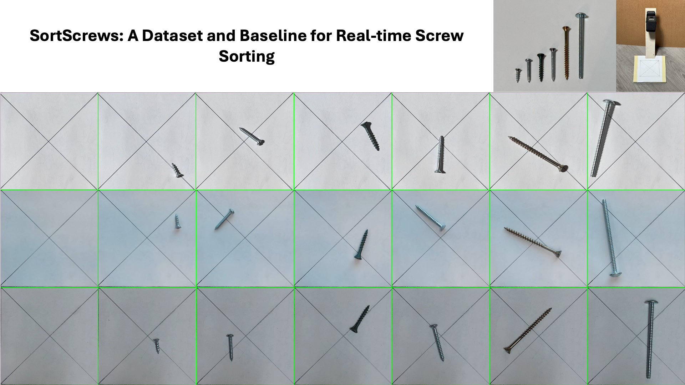

# SortScrew



SortScrew is a dataset for screw classification. We collected 560 images of 6 types of screws.

## Citation

```bibtex
@misc{fu2026sortscrewsdatasetbaselinerealtime,
      title={SortScrews: A Dataset and Baseline for Real-time Screw Classification}, 
      author={Tianhao Fu and Bingxuan Yang and Juncheng Guo and Shrena Sribalan and Yucheng Chen},
      year={2026},
      eprint={2603.13027},
      archivePrefix={arXiv},
      primaryClass={cs.CV},
      url={https://arxiv.org/abs/2603.13027}, 
}
```

## Dataset Download

You can download the dataset from
[Project Neura's Central Data Server (CDS)](https://cds.projectneura.org/atatc/ut/esc102/SortScrews.zip).

Alternatively, you can download the dataset using MIP Candy:

```python
from mipcandy import download_dataset

download_dataset("atatc/ut/esc102/SortScrews", "directory/to/save/dataset")
```

## Codebase Installation

Our codebase contains necessary utilities to use the dataset.

```shell
pip install git+https://github.com/ATATC/SortScrews
```

To customize your own dataset, train your own model, or run inference using our codebase, please clone the whole
repository.

## Class Indices

We rank the screws by their lengths. Class indices are assigned from 1 to 6, from left to right.

Class 0 is reserved for the background.


## Customization

You could use "collect.py" to collect your own dataset.

| Key                         | Usage                 |
|-----------------------------|-----------------------|
| <kbd>C</kbd>                | Capture current frame |
| <kbd>X</kbd>                | Remove last entry     |
| <kbd>0</kbd> - <kbd>9</kbd> | Set class ID          |
| <kbd>Q</kbd>                | Quit                  |

To append an existing dataset, simply replace

```python
app = Collector()
```

with

```python
app = Collector(append_from=LENGTH_OF_EXISTING_DATASET)
```

## Acknowledgement

We kindly ask other Praxis II groups not to copy our solution. We do not permit other groups to use our dataset.